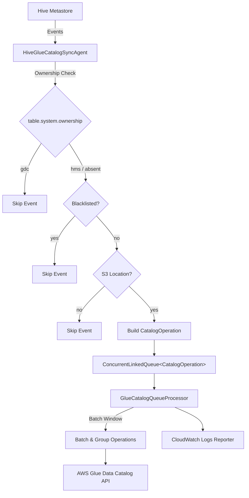
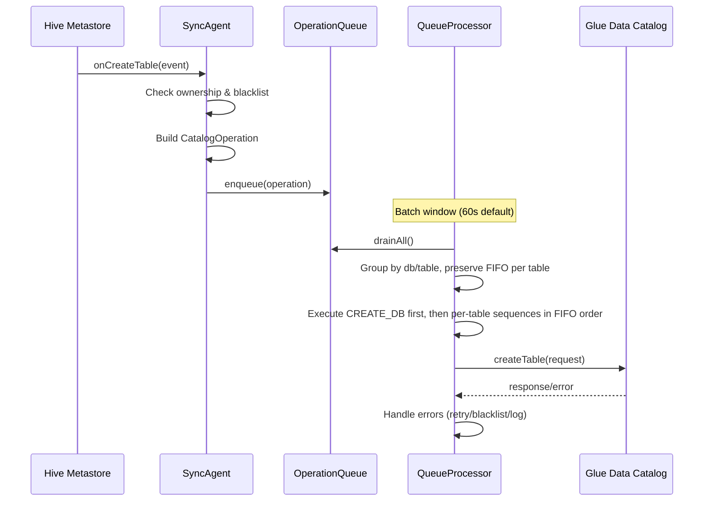

# Design Document: GDC Direct API Sync

## Overview

This design replaces the Athena JDBC-based synchronization in HiveGlueCatalogSyncAgent with direct AWS Glue Data Catalog (GDC) API calls. The core architectural pattern is preserved: a MetaStoreEventListener enqueues structured operation objects into a ConcurrentLinkedQueue, and a background thread drains the queue in batched windows, executing GDC API calls.

Key design decisions:
- **Command pattern** for catalog operations: each event produces a typed `CatalogOperation` object instead of a DDL string.
- **Batch window** processing: the queue processor sleeps for a configurable window, then drains and groups all pending operations before executing.
- **Table ownership** check at the event handler level to prevent circular updates.
- **In-memory blacklist** for tables with unresolvable conflicts.
- **GDC client abstraction** via an interface to enable unit testing with mocks.

## Architecture



### Processing Flow



## Components and Interfaces

### 1. CatalogOperation (Immutable Value Object)

Represents a single catalog sync action. Replaces the `String` DDL in the queue.

```java
public class CatalogOperation {
    public enum OperationType {
        CREATE_TABLE, DROP_TABLE, ADD_PARTITIONS, DROP_PARTITIONS, UPDATE_TABLE, CREATE_DATABASE
    }

    private final OperationType type;
    private final String databaseName;
    private final String tableName;       // null for CREATE_DATABASE
    private final Object payload;         // type-specific payload (see below)

    // Constructor, getters (no setters — immutable)
}
```

**Payload types by operation:**
| OperationType | Payload Type |
|---|---|
| CREATE_TABLE | `TableInput` |
| DROP_TABLE | `null` |
| ADD_PARTITIONS | `List<PartitionInput>` |
| DROP_PARTITIONS | `List<PartitionValueList>` |
| UPDATE_TABLE | `TableInput` |
| CREATE_DATABASE | `DatabaseInput` |

### 2. TableInputBuilder (Utility Class)

Converts Hive `Table` metadata to AWS Glue `TableInput`. Replaces `HiveUtils.showCreateTable()`.

```java
public class TableInputBuilder {
    public static TableInput buildTableInput(Table hiveTable);
    public static StorageDescriptor buildStorageDescriptor(
        org.apache.hadoop.hive.metastore.api.StorageDescriptor hiveSd);
    public static List<Column> buildColumns(List<FieldSchema> fields);
    public static PartitionInput buildPartitionInput(Partition partition);
    public static String translateLocation(String location);
}
```

Key mappings:
- `FieldSchema(name, type, comment)` → `Column().withName().withType().withComment()`
- Hive `StorageDescriptor` → Glue `StorageDescriptor` (inputFormat, outputFormat, serdeInfo, location, columns)
- Hive `SerDeInfo` → Glue `SerDeInfo` (serializationLibrary, parameters)
- S3 path normalization: `s3a://` and `s3n://` → `s3://`
- Table parameters → `TableInput.parameters` (excluding stats keys)

### 3. GlueCatalogQueueProcessor (Inner Class → Runnable)

Replaces `AthenaQueueProcessor`. Consumes `CatalogOperation` objects from the queue.

```java
private final class GlueCatalogQueueProcessor implements Runnable {
    private final AWSGlue glueClient;
    private final CloudWatchLogsReporter cwlr;
    private final String catalogId;          // optional
    private final boolean dropTableIfExists;
    private final boolean createMissingDB;
    private final int batchWindowMs;
    private final int initialBackoffMs;
    private final double backoffMultiplier;
    private final int maxRetryAttempts;
    private volatile boolean running = true;

    public void stop();
    public void run();

    // Internal methods
    private void processBatch(List<CatalogOperation> batch);
    private Map<String, List<CatalogOperation>> groupOperations(List<CatalogOperation> ops);
    private void executeCreateTable(CatalogOperation op);
    private void executeDropTable(CatalogOperation op);
    private void executeAddPartitions(CatalogOperation op);
    private void executeDropPartitions(CatalogOperation op);
    private void executeUpdateTable(CatalogOperation op);
    private void executeCreateDatabase(CatalogOperation op);
    private boolean isTransientError(AmazonServiceException e);
}
```

**Batch processing logic:**
1. Sleep for `batchWindowMs`
2. Drain all operations from queue into a list (preserving insertion order)
3. Group by `(databaseName, tableName)` — preserving FIFO order within each group
4. Merge compatible *consecutive* operations within each per-table group:
   - Consecutive ADD_PARTITIONS: concatenate partition lists
   - Consecutive DROP_PARTITIONS: concatenate partition value lists
   - Consecutive DROP_TABLE: deduplicate to single call
   - Consecutive CREATE_TABLE / UPDATE_TABLE: keep only the last
5. Execute CREATE_DATABASE operations first, then execute per-table operation sequences preserving their original FIFO order

### 4. HiveGlueCatalogSyncAgent (Refactored)

The main class changes:
- Queue type: `ConcurrentLinkedQueue<CatalogOperation>` (was `ConcurrentLinkedQueue<String>`)
- Remove: `athenaConnection`, `configureAthenaConnection()`, `addToAthenaQueue(String)`
- Add: `glueClient` (AWSGlue), `catalogId`, `blacklistedTables` (ConcurrentHashMap.KeySetView)
- Add: `isTableOwnershipValid(Table)` — checks `table.system.ownership`
- Add: `isBlacklisted(String dbName, String tableName)` — checks blacklist
- Add: `isSyncEligible(Table)` — checks S3 location (after s3a/s3n translation), no custom storage handler, and ownership
- Add: `addToQueue(CatalogOperation)` — replaces `addToAthenaQueue`
- Event handlers build `CatalogOperation` objects instead of DDL strings

### 5. GlueClientFactory (Utility)

Creates the `AWSGlue` client from Hadoop Configuration.

```java
public class GlueClientFactory {
    public static AWSGlue createClient(Configuration config);
}
```

Uses `glue.catalog.region` for region, falls back to default provider chain for credentials.

## Data Models

### CatalogOperation

```java
public class CatalogOperation {
    public enum OperationType {
        CREATE_TABLE, DROP_TABLE, ADD_PARTITIONS, DROP_PARTITIONS, UPDATE_TABLE, CREATE_DATABASE
    }

    private final OperationType type;
    private final String databaseName;
    private final String tableName;
    private final Object payload;
    private final long timestamp;  // for ordering within batch

    public CatalogOperation(OperationType type, String databaseName, String tableName, Object payload) {
        this.type = type;
        this.databaseName = databaseName;
        this.tableName = tableName;
        this.payload = payload;
        this.timestamp = System.nanoTime();
    }

    public OperationType getType() { return type; }
    public String getDatabaseName() { return databaseName; }
    public String getTableName() { return tableName; }
    @SuppressWarnings("unchecked")
    public <T> T getPayload() { return (T) payload; }
    public long getTimestamp() { return timestamp; }

    public String getFullTableName() {
        return tableName != null ? databaseName + "." + tableName : databaseName;
    }
}
```

### Configuration Properties

| Property | Type | Default | Description |
|---|---|---|---|
| `glue.catalog.region` | String | `us-east-1` | AWS region for GDC client |
| `glue.catalog.id` | String | null | Optional Glue Catalog ID |
| `glue.catalog.dropTableIfExists` | boolean | false | Drop and recreate on AlreadyExistsException |
| `glue.catalog.createMissingDB` | boolean | true | Auto-create missing databases |
| `glue.catalog.suppressAllDropEvents` | boolean | false | Suppress all drop events |
| `glue.catalog.batch.window.seconds` | int | 60 | Batch window duration in seconds |
| `glue.catalog.syncTableStatistics` | boolean | false | Include Hive table statistics in GDC table parameters |
| `glue.catalog.retry.initialBackoffMs` | int | 1000 | Initial backoff duration in ms for transient error retries |
| `glue.catalog.retry.backoffMultiplier` | double | 2.0 | Multiplier applied to backoff after each retry |
| `glue.catalog.retry.maxAttempts` | int | 5 | Maximum number of retry attempts for transient errors |

### Removed Configuration Properties

| Property | Reason |
|---|---|
| `glue.catalog.athena.jdbc.url` | Athena JDBC no longer used |
| `glue.catalog.athena.s3.staging.dir` | Athena staging no longer needed |
| `glue.catalog.user.key` | Replaced by default credential provider chain |
| `glue.catalog.user.secret` | Replaced by default credential provider chain |

### Hive-to-Glue Type Mapping

The `TableInputBuilder` performs these mappings:

```
Hive FieldSchema          → Glue Column
  .name                   → .name
  .type                   → .type
  .comment                → .comment

Hive StorageDescriptor    → Glue StorageDescriptor
  .inputFormat            → .inputFormat
  .outputFormat           → .outputFormat
  .location               → .location (s3a/s3n → s3)
  .cols                   → .columns (via Column mapping)
  .serdeInfo.serializationLib → .serdeInfo.serializationLibrary
  .serdeInfo.parameters   → .serdeInfo.parameters

Hive Table                → Glue TableInput
  .tableName              → .name
  .tableType              → .tableType
  .parameters             → .parameters
  .partitionKeys          → .partitionKeys (via Column mapping)
  .sd                     → .storageDescriptor (via SD mapping)
```

### Batch Grouping Key

Operations are grouped by a composite key for per-table FIFO processing:

```java
String groupKey = databaseName + "." + tableName;
```

Within each group, operations preserve their original enqueue order (FIFO). Only consecutive operations of the same type are eligible for merging. This ensures that a sequence like DROP_TABLE → CREATE_TABLE is never reordered.

## Correctness Properties

*A property is a characteristic or behavior that should hold true across all valid executions of a system — essentially, a formal statement about what the system should do. Properties serve as the bridge between human-readable specifications and machine-verifiable correctness guarantees.*

### Property 1: Hive-to-Glue Table Conversion Preserves Metadata

*For any* valid Hive Table with columns, partition keys, storage descriptor, and parameters, converting it via `TableInputBuilder.buildTableInput()` SHALL produce a Glue `TableInput` where:
- Each Hive column's name, type, and comment matches the corresponding Glue Column
- The Glue StorageDescriptor's inputFormat, outputFormat, serdeInfo (library + parameters), and location match the Hive StorageDescriptor
- Partition keys are correctly mapped to Glue Column objects
- Table parameters are preserved

**Validates: Requirements 2.1, 2.2, 2.3, 2.5, 2.6**

### Property 2: S3 Path Translation Normalizes All Variants

*For any* S3 path string starting with `s3a://` or `s3n://`, `TableInputBuilder.translateLocation()` SHALL return a path starting with `s3://` with the remainder unchanged. For paths already starting with `s3://`, the output SHALL be identical to the input.

**Validates: Requirements 2.4**

### Property 3: Event Filtering Gates on S3 Location

*For any* Hive Table and any event type (CreateTable, DropTable, AddPartition, DropPartition, AlterTable), the Sync_Agent SHALL enqueue a CatalogOperation if and only if the table's storage location starts with `s3` (after s3a/s3n translation) and the table does not use a custom storage handler. Tables that do not meet these conditions SHALL produce no enqueued operations.

**Validates: Requirements 4.1, 4.2, 5.1, 6.1, 7.1, 8.1, 8.2**

### Property 4: Table Ownership Filtering Prevents Circular Updates

*For any* Hive Table and any event type, if the table's parameters contain `table.system.ownership` set to `gdc`, the Sync_Agent SHALL not enqueue any CatalogOperation. If the property is set to `hms` or is absent, the event SHALL be processed normally (subject to other filters).

**Validates: Requirements 3.1, 3.2, 3.3**

### Property 5: Blacklisted Tables Are Excluded From All Operations

*For any* table that has been added to the blacklist, all subsequent metastore events for that table SHALL result in no CatalogOperation being enqueued, regardless of event type.

**Validates: Requirements 9.1, 9.2**

### Property 6: Suppress Drop Events Flag Blocks All Drop Operations

*For any* Hive Table, when `suppressAllDropEvents` is enabled, DropTable and DropPartition events SHALL produce no enqueued CatalogOperations. When disabled, eligible drop events SHALL be enqueued normally.

**Validates: Requirements 5.2, 7.2**

### Property 7: Only S3-Based Partitions Are Included in Partition Operations

*For any* AddPartition or DropPartition event containing a mix of S3-based and non-S3-based partitions, the resulting CatalogOperation SHALL include only the partitions with S3-based locations. Non-S3 partitions SHALL be excluded from the payload.

**Validates: Requirements 6.4, 7.4**

### Property 8: Batch Grouping Produces Correct Groups

*For any* list of CatalogOperations, grouping by (operationType, databaseName, tableName) SHALL produce groups where every operation in a group has the same operation type, database name, and table name, and every operation from the input appears in exactly one group.

**Validates: Requirements 10.2**

### Property 9: Batch Merging Concatenates Consecutive Partition Operations

*For any* sequence of consecutive ADD_PARTITIONS operations targeting the same database and table within a per-table FIFO group, merging SHALL produce a single operation whose partition list is the concatenation of all individual partition lists (preserving order). The same applies to consecutive DROP_PARTITIONS operations with partition value lists.

**Validates: Requirements 10.3, 10.4**

### Property 10: Batch Deduplication Uses Last-Write-Wins for Consecutive Table Operations

*For any* sequence of consecutive CREATE_TABLE or UPDATE_TABLE operations targeting the same database and table within a per-table FIFO group, merging SHALL produce a single operation using the payload from the last operation. For consecutive DROP_TABLE operations, merging SHALL produce exactly one operation.

**Validates: Requirements 10.5, 10.6, 10.7**

### Property 11: Batch Execution Preserves Per-Table FIFO Order

*For any* batch of CatalogOperations, operations targeting the same database and table SHALL be executed in the order they were enqueued (FIFO). Operations targeting different tables MAY be executed in any order. CREATE_DATABASE operations SHALL be executed before any operations that reference that database.

**Validates: Requirements 11.1**

### Property 12: CloudWatch Log Messages Contain Required Fields

*For any* CatalogOperation execution (success or failure), the message sent to CloudWatch Logs SHALL contain the operation type, database name, and table name. For failed operations, the message SHALL additionally contain the error details.

**Validates: Requirements 14.1, 14.2**

## Error Handling

### Unsupported Hive Features in GDC

The following Hive features have no direct equivalent in the Glue Data Catalog. The `TableInputBuilder` handles them as follows:

| Hive Feature | GDC Support | Handling |
|---|---|---|
| Skewed tables (SKEWED BY) | Not supported | Skewed info is dropped during conversion; a warning is logged |
| Custom storage handlers (e.g., HBase) | Not supported | Tables with non-null `StorageHandler` are skipped; event is ignored with a warning |
| Compaction (ACID/transactional) | Not supported | Already excluded — only tables with S3 locations are synced |
| Table statistics (numRows, rawDataSize, etc.) | Supported | Controlled by `glue.catalog.syncTableStatistics` config (default false). When enabled, Hive stats keys are included in table parameters. When disabled, they are excluded. |
| Bucketing (CLUSTERED BY / SORTED BY) | Partial support | `bucketColumns`, `sortColumns`, and `numberOfBuckets` are mapped to GDC StorageDescriptor fields |

### GDC API Error Classification

| Error Type | Classification | Action |
|---|---|---|
| `AmazonServiceException` with status 429 (Throttling) | Transient | Retry after backoff |
| `AmazonServiceException` with status 500/503 | Transient | Retry after backoff |
| `AlreadyExistsException` on createTable | Conditional | If `dropTableIfExists`: drop + retry. Else: blacklist table |
| `EntityNotFoundException` on deleteTable | Inconsistency | Log warning, skip |
| `EntityNotFoundException` on batchCreatePartition | Inconsistency | Log warning, skip (table doesn't exist in GDC) |
| `EntityNotFoundException` on batchDeletePartition | Inconsistency | Log warning, skip |
| `EntityNotFoundException` on createTable (database) | Conditional | If `createMissingDB`: create DB + retry. Else: log error, skip |
| All other `AmazonServiceException` | Non-transient | Log error to CWL, skip |

### Retry Strategy

- Transient errors: exponential backoff with configurable parameters
  - `glue.catalog.retry.initialBackoffMs` (default 1000ms) — initial wait before first retry
  - `glue.catalog.retry.backoffMultiplier` (default 2.0) — multiplier applied to backoff after each retry
  - `glue.catalog.retry.maxAttempts` (default 5) — maximum number of retry attempts
  - Backoff formula: `initialBackoffMs * (backoffMultiplier ^ attemptNumber)`
  - Example with defaults: 1s → 2s → 4s → 8s → 16s
- After max retries exhausted: log error to CWL, move to next operation

### Blacklisting Behavior

- Tables are blacklisted when `AlreadyExistsException` occurs and `dropTableIfExists` is disabled
- Blacklist is checked at event handler level (before enqueuing) for efficiency
- Blacklist is a `ConcurrentHashMap.newKeySet()` for thread safety
- Blacklisted table names are logged at DEBUG level when events are skipped

## Testing Strategy

### Property-Based Testing

**Library**: [jqwik](https://jqwik.net/) — a JUnit 5-compatible property-based testing framework for Java.

**Configuration**: Each property test runs a minimum of 100 iterations.

**Tag format**: Each test is annotated with a comment referencing the design property:
```java
// Feature: gdc-direct-api-sync, Property N: <property title>
```

**Property tests to implement:**

1. **Property 1**: Generate random Hive Tables (random columns, partition keys, storage descriptors, parameters) and verify `TableInputBuilder.buildTableInput()` produces matching Glue TableInput.
2. **Property 2**: Generate random S3 paths with s3://, s3a://, s3n:// prefixes and verify `translateLocation()` normalizes correctly.
3. **Property 3**: Generate random Tables with varying tableType and location prefixes, invoke event handlers, and verify queue state matches the external+s3 predicate.
4. **Property 4**: Generate random Tables with varying `table.system.ownership` values, invoke event handlers, and verify only non-gdc tables produce operations.
5. **Property 5**: Generate random table names, add some to blacklist, invoke events, and verify blacklisted tables produce no operations.
6. **Property 6**: Generate random Tables, toggle `suppressAllDropEvents`, invoke drop events, and verify queue state.
7. **Property 7**: Generate AddPartition events with mixed S3/non-S3 partitions and verify only S3 partitions appear in the payload.
8. **Property 8**: Generate random lists of CatalogOperations and verify grouping correctness (partition + coverage).
9. **Property 9**: Generate multiple ADD_PARTITIONS/DROP_PARTITIONS ops for the same table and verify merged payload is the concatenation.
10. **Property 10**: Generate multiple CREATE_TABLE/UPDATE_TABLE/DROP_TABLE ops for the same table and verify last-write-wins / dedup.
11. **Property 11**: Generate random batches of mixed operations and verify that per-table FIFO order is preserved and CREATE_DATABASE operations execute before dependent table operations.
12. **Property 12**: Generate random CatalogOperations, execute them (with mock GDC client), and verify CWL messages contain required fields.

### Unit Tests (Examples and Edge Cases)

Unit tests complement property tests by covering specific scenarios:

- **CreateTable with AlreadyExistsException + dropTableIfExists=true**: Verify drop + retry sequence
- **CreateTable with AlreadyExistsException + dropTableIfExists=false**: Verify blacklisting
- **CreateTable with EntityNotFoundException + createMissingDB=true**: Verify createDatabase + retry
- **DeleteTable with EntityNotFoundException**: Verify graceful skip
- **Transient error retry**: Verify retry with backoff
- **Non-transient error**: Verify error logged and operation skipped
- **Configuration reading**: Verify all config properties are read with correct defaults
- **Empty batch window**: Verify no API calls when queue is empty
- **PartitionInput building**: Verify specific partition value/location/SD mapping

### Test Dependencies

Add to `pom.xml` (test scope):
- `net.jqwik:jqwik:1.7.4` — property-based testing
- `org.mockito:mockito-core:4.11.0` — mocking GDC client
- `junit:junit:4.13.1` — existing (keep for backward compatibility with existing tests)
