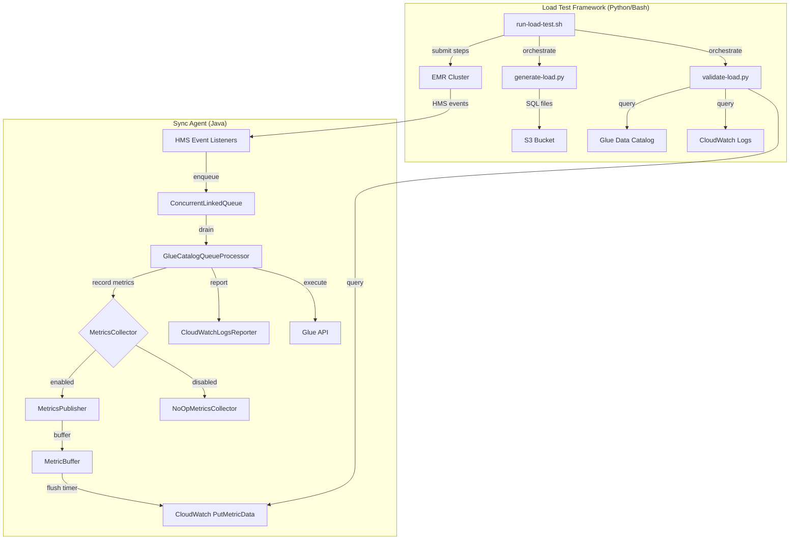

# Design Document: Load Testing and Metrics

## Overview

This design adds two capabilities to the Hive Glue Catalog Sync Agent:

1. **CloudWatch Metrics Instrumentation** — A `MetricsPublisher` component that collects operational metrics (queue depth, sync lag, throughput, errors, throttles) and publishes them to CloudWatch Metrics in batches. The feature is opt-in via Hadoop configuration and imposes zero overhead when disabled.

2. **Load Testing Framework** — A set of Python/Bash scripts under `integration-tests/load-test/` that generate parameterized Spark SQL DDL, submit it to EMR, wait for sync completion, collect CloudWatch Metrics, and produce a pass/fail report.

The metrics instrumentation follows the same pattern as the existing `CloudWatchLogsReporter`: a dedicated class that receives an AWS client built from Hadoop configuration and is called from the `GlueCatalogQueueProcessor`. The key difference is that the `MetricsPublisher` buffers data points and flushes them periodically rather than writing on every event.

The zero-overhead constraint is achieved through a **Null Object pattern**: when metrics are disabled, the agent uses a `NoOpMetricsCollector` that has empty method bodies, avoiding any conditional checks in the hot path.

## Architecture



### Metrics Data Flow

1. `GlueCatalogQueueProcessor` calls `MetricsCollector.recordXxx()` methods at instrumentation points
2. When enabled, `MetricsPublisher` stores `MetricDatum` objects in a thread-safe buffer
3. A scheduled flush thread calls `PutMetricData` at the configured interval
4. On shutdown, the flush thread performs a final drain of the buffer

### Load Test Data Flow

1. `generate-load.py` reads scenario parameters and produces `.sql` files
2. `run-load-test.sh` uploads artifacts, deploys CFN stack, submits EMR steps
3. EMR runs Spark SQL → HMS events → Sync Agent → Glue Data Catalog
4. `validate-load.py` polls GDC for completeness, queries CW Metrics for performance, checks CWL for errors

## Components and Interfaces

### MetricsCollector Interface

The `MetricsCollector` interface defines the contract for recording metrics. Two implementations exist:

```java
/**
 * Contract for recording sync agent operational metrics.
 * Implementations must be thread-safe (called from QueueProcessor thread).
 */
public interface MetricsCollector {
    void recordQueueDepth(int depth);
    void recordBatchSize(int size);
    void recordSyncLagMs(long lagMs);
    void recordOperationSuccess(CatalogOperation.OperationType type);
    void recordOperationFailure(CatalogOperation.OperationType type);
    void recordRetryCount(CatalogOperation.OperationType type, int count);
    void recordBatchProcessingTimeMs(long timeMs);
    void recordThrottleCount();
    void flush();
    void shutdown();
}
```

### NoOpMetricsCollector

```java
/**
 * Null Object implementation — all methods are empty.
 * Used when metrics are disabled to avoid conditional checks in hot path.
 */
public class NoOpMetricsCollector implements MetricsCollector {
    // All methods are empty no-ops
}
```

### MetricsPublisher

```java
/**
 * Collects MetricDatum objects in a thread-safe buffer and publishes
 * them to CloudWatch at a configurable interval.
 *
 * Thread safety: Uses ConcurrentLinkedQueue for the buffer (lock-free).
 * The flush thread is the only consumer.
 */
public class MetricsPublisher implements MetricsCollector {
    private final AmazonCloudWatch cloudWatchClient;
    private final String namespace;
    private final ConcurrentLinkedQueue<MetricDatum> buffer;
    private final ScheduledExecutorService scheduler;
    private static final int CW_MAX_DATAPOINTS_PER_REQUEST = 1000;

    public MetricsPublisher(Configuration config) { ... }

    // Each record method creates a MetricDatum and adds it to the buffer
    // flush() drains the buffer and calls PutMetricData (splitting at 1000)
    // shutdown() flushes remaining metrics and shuts down the scheduler
}
```

### MetricsCollectorFactory

```java
/**
 * Factory that reads Hadoop configuration and returns the appropriate
 * MetricsCollector implementation.
 */
public class MetricsCollectorFactory {
    static final String METRICS_ENABLED = "glue.catalog.metrics.enabled";
    static final String METRICS_NAMESPACE = "glue.catalog.metrics.namespace";
    static final String METRICS_PUBLISH_INTERVAL = "glue.catalog.metrics.publish.interval.seconds";
    static final String DEFAULT_NAMESPACE = "HiveGlueCatalogSync";
    static final int DEFAULT_PUBLISH_INTERVAL = 60;

    public static MetricsCollector create(Configuration config) {
        boolean enabled = config.getBoolean(METRICS_ENABLED, false);
        if (!enabled) {
            return new NoOpMetricsCollector();
        }
        return new MetricsPublisher(config);
    }
}
```

### Integration Points in GlueCatalogQueueProcessor

The `MetricsCollector` is injected into `GlueCatalogQueueProcessor` via its constructor. Instrumentation points:

| Location | Metric | When |
|---|---|---|
| `run()` — before `queue.poll()` loop | `QueueDepth` | Start of each batch cycle |
| `run()` — after drain loop | `BatchSize` | After draining queue |
| `run()` — after `processBatch()` | `BatchProcessingTimeMs` | After batch completes |
| `executeOperation()` — on success | `OperationSuccess` | After successful Glue API call |
| `executeOperation()` — on permanent failure | `OperationFailure` | After retries exhausted |
| `executeOperation()` — on completion | `SyncLagMs` | After operation executes (enqueue timestamp to now) |
| `executeOperation()` — retry loop | `RetryCount` | After retries complete |
| `isTransientError()` — on 429 | `ThrottleCount` | When throttle detected |

### Load Test Scripts

| Script | Language | Purpose |
|---|---|---|
| `generate-load.py` | Python 3 | Generates Spark SQL DDL files from scenario parameters |
| `run-load-test.sh` | Bash | Orchestrates: generate → upload → deploy → submit → wait → validate → cleanup |
| `validate-load.py` | Python 3 | Polls GDC for completeness, queries CW Metrics, checks CWL, produces report |

### generate-load.py Interface

```
Usage: python3 generate-load.py --scenario <name> --output-dir <dir> --s3-bucket <bucket>
       [--databases N] [--tables-per-db N] [--partitions-per-table N]

Scenarios: burst-create, partition-heavy, multi-db, mixed-ops, sustained
```

Produces one or more `.sql` files in the output directory. Each file contains Spark SQL DDL statements.

### validate-load.py Interface

```
Usage: python3 validate-load.py --database <db> --region <region>
       --scenario <name> --expected-tables N --expected-partitions N
       [--metrics-namespace <ns>] [--sync-lag-threshold-ms N]
       [--s3-output <s3-path>]
```

Outputs a JSON summary report and exits 0 (pass) or 1 (fail).

## Data Models

### MetricDatum (AWS SDK v1)

The `MetricsPublisher` uses the AWS SDK v1 `MetricDatum` class directly:

```java
import com.amazonaws.services.cloudwatch.model.MetricDatum;
import com.amazonaws.services.cloudwatch.model.Dimension;
import com.amazonaws.services.cloudwatch.model.StandardUnit;
```

Each metric is represented as a `MetricDatum` with:
- `MetricName`: One of QueueDepth, BatchSize, SyncLagMs, OperationSuccess, OperationFailure, RetryCount, BatchProcessingTimeMs, ThrottleCount
- `Value`: The numeric value
- `Unit`: Count, Milliseconds, or None as appropriate
- `Timestamp`: The time the metric was recorded
- `Dimensions`: Optional, e.g., `OperationType=CREATE_TABLE`

### Scenario Configuration (Python)

```python
SCENARIOS = {
    "burst-create": {
        "databases": 1,
        "tables_per_db": 100,
        "partitions_per_table": 0,
        "operations": ["create"],
        "description": "CreateTable throughput, batch merging"
    },
    "partition-heavy": {
        "databases": 1,
        "tables_per_db": 5,
        "partitions_per_table": 200,
        "operations": ["create"],
        "description": "BatchCreatePartition batching, Glue API limits"
    },
    "multi-db": {
        "databases": 10,
        "tables_per_db": 10,
        "partitions_per_table": 10,
        "operations": ["create"],
        "description": "CreateDatabase + cross-DB parallelism"
    },
    "mixed-ops": {
        "databases": 1,
        "tables_per_db": 50,
        "partitions_per_table": 20,
        "operations": ["create", "alter", "drop"],
        "description": "Create → Alter → Drop interleaving"
    },
    "sustained": {
        "databases": 1,
        "tables_per_db": 500,
        "partitions_per_table": 5,
        "operations": ["create"],
        "description": "Queue depth, memory, long-running stability"
    }
}
```

### Validation Report (Python)

```python
{
    "scenario": "burst-create",
    "total_operations": 100,
    "sync_completeness_pct": 100.0,
    "tables_expected": 100,
    "tables_found": 100,
    "partitions_expected": 0,
    "partitions_found": 0,
    "avg_sync_lag_ms": 1234.5,
    "p99_sync_lag_ms": 4567.8,
    "operation_success_count": 100,
    "operation_failure_count": 0,
    "throttle_count": 2,
    "cwl_errors": [],
    "cwl_disallowed": [],
    "pass": true,
    "failure_reasons": []
}
```


## Correctness Properties

*A property is a characteristic or behavior that should hold true across all valid executions of a system — essentially, a formal statement about what the system should do. Properties serve as the bridge between human-readable specifications and machine-verifiable correctness guarantees.*

### Property 1: Factory returns correct implementation based on config

*For any* Hadoop Configuration, if `glue.catalog.metrics.enabled` is `true` then `MetricsCollectorFactory.create()` returns a `MetricsPublisher` instance; if `false` or absent, it returns a `NoOpMetricsCollector` instance.

**Validates: Requirements 1.1, 1.2**

### Property 2: Namespace and interval configuration pass-through

*For any* non-empty namespace string and any positive integer interval, when set in Hadoop Configuration, the `MetricsPublisher` SHALL use that namespace in all `PutMetricData` requests and schedule flushes at that interval. When absent, the defaults `HiveGlueCatalogSync` and `60` are used.

**Validates: Requirements 1.3, 1.4, 3.6**

### Property 3: Queue depth and batch size recording

*For any* non-negative number of CatalogOperations enqueued before a drain cycle, the MetricsCollector records a `QueueDepth` metric equal to the queue size before draining and a `BatchSize` metric equal to the number of operations actually drained.

**Validates: Requirements 2.1, 2.2**

### Property 4: SyncLagMs is non-negative and reflects enqueue-to-execution time

*For any* CatalogOperation, the recorded `SyncLagMs` metric is non-negative and equals the wall-clock difference in milliseconds between the operation's enqueue timestamp and execution completion time.

**Validates: Requirements 2.3**

### Property 5: Operation outcome metrics record correct type dimension

*For any* CatalogOperation of any OperationType, when the Glue API call succeeds, an `OperationSuccess` metric with dimension `OperationType=<type>` is recorded; when it fails permanently, an `OperationFailure` metric with the same dimension is recorded; when retries occur, a `RetryCount` metric with the retry count is recorded; when a 429 is received, a `ThrottleCount` metric is recorded.

**Validates: Requirements 2.4, 2.5, 2.6, 2.8**

### Property 6: Batch processing time is non-negative

*For any* batch of operations, the recorded `BatchProcessingTimeMs` metric is non-negative and represents the wall-clock time to process the entire batch.

**Validates: Requirements 2.7**

### Property 7: Flush batches metrics into correct number of API calls

*For any* number N of buffered MetricDatum objects, calling `flush()` results in exactly `ceil(N / 1000)` `PutMetricData` API calls, each containing at most 1000 data points, and the buffer is empty afterward.

**Validates: Requirements 3.1, 3.3**

### Property 8: Shutdown flushes all remaining metrics

*For any* set of buffered metrics, calling `shutdown()` results in all buffered metrics being published via `PutMetricData` before the publisher terminates, and the buffer is empty afterward.

**Validates: Requirements 3.4**

### Property 9: DDL generation produces correct statement counts

*For any* scenario parameters (databases D, tables-per-db T, partitions-per-table P), the generated SQL contains exactly D `CREATE DATABASE` statements, D×T `CREATE TABLE` statements, and the correct number of `ALTER TABLE ADD PARTITION` statements based on P.

**Validates: Requirements 5.1**

### Property 10: DDL generation parameterizes S3 bucket

*For any* S3 bucket name, all `LOCATION` clauses in the generated SQL contain that bucket name.

**Validates: Requirements 5.4**

### Property 11: Sync completeness validation

*For any* set of expected table names and actual GDC table names, the validator computes sync completeness as `|expected ∩ actual| / |expected| × 100` and reports pass only when completeness is 100%.

**Validates: Requirements 7.1**

### Property 12: CWL error detection

*For any* set of CloudWatch Logs entries, the validator correctly identifies all entries containing `DISALLOWED` or `ERROR` status and includes them in the failure report.

**Validates: Requirements 7.2**

### Property 13: Sync lag threshold enforcement

*For any* sync lag value and configurable threshold, the validator reports pass when lag ≤ threshold and fail when lag > threshold.

**Validates: Requirements 7.4**

### Property 14: Validation report completeness

*For any* validation result, the produced summary report contains all required fields: scenario name, total operations, sync completeness percentage, average sync lag, p99 sync lag, operation success count, operation failure count, throttle count, and pass/fail verdict.

**Validates: Requirements 7.5**

## Error Handling

### MetricsPublisher Errors

| Error | Handling | Rationale |
|---|---|---|
| `PutMetricData` throws exception | Log error at WARN level, discard the batch, continue buffering new metrics | Prevents unbounded memory growth; metrics are best-effort |
| CloudWatch client creation fails | Log error, fall back to `NoOpMetricsCollector` | Agent should not fail to start due to metrics |
| Buffer grows very large (>10,000 data points) | Log warning, continue normal flush cycle | CW API limits will naturally throttle; no need to drop data preemptively |
| Scheduler thread interrupted during shutdown | Perform one final synchronous flush attempt, then terminate | Best-effort final flush |

### Load Test Errors

| Error | Handling | Rationale |
|---|---|---|
| EMR step fails | Log step failure details, continue to validation (which will report failures) | Partial results are still useful for debugging |
| GDC polling timeout | Report sync completeness at timeout, mark test as failed | Avoids infinite wait |
| CloudWatch Metrics query returns no data | Report metrics as unavailable, do not fail the test on missing metrics alone | Metrics may not be enabled or may have propagation delay |
| CFN stack creation fails | Log error, attempt cleanup, exit with failure | Fail fast on infrastructure issues |
| Cleanup fails | Log warning, continue (resources may need manual cleanup) | Best-effort cleanup; don't mask test results |

## Testing Strategy

### Unit Tests (JUnit 4 + Mockito)

Unit tests verify specific examples, edge cases, and integration points:

- `MetricsCollectorFactory` returns correct type for enabled/disabled configs
- `NoOpMetricsCollector` methods are callable without side effects
- `MetricsPublisher` creates correct `MetricDatum` objects with proper names, units, and dimensions
- `MetricsPublisher.flush()` calls `PutMetricData` with correct request structure
- `MetricsPublisher.shutdown()` performs final flush
- Error handling: `PutMetricData` failure logs and discards
- `generate-load.py` scenario definitions match expected parameters

### Property-Based Tests (jqwik)

Property tests verify universal correctness properties across randomized inputs. Each property test:
- Runs a minimum of 100 iterations
- References its design document property via a tag comment
- Uses jqwik's `@Property` annotation with `@ForAll` parameters

| Property | Test Description | Generator |
|---|---|---|
| Property 1 | Factory returns correct type | Random boolean for enabled + random config values |
| Property 2 | Namespace/interval pass-through | Random strings for namespace, random positive ints for interval |
| Property 3 | Queue depth and batch size | Random list of CatalogOperations (0-500) |
| Property 5 | Operation outcome metrics | Random OperationType × random outcome (success/failure/retry/throttle) |
| Property 7 | Flush batching | Random number of MetricDatum objects (0-3000) |
| Property 8 | Shutdown flushes all | Random number of buffered metrics |
| Property 9 | DDL statement counts | Random D (1-20), T (1-100), P (0-50) |
| Property 10 | S3 bucket parameterization | Random bucket name strings |
| Property 11 | Sync completeness | Random sets of expected and actual table names |
| Property 13 | Lag threshold | Random lag values and thresholds |
| Property 14 | Report completeness | Random validation result data |

### Property-Based Testing Configuration

- Library: **jqwik 1.7.4** (already in pom.xml)
- Minimum iterations: 100 per property
- Tag format: `Feature: load-testing-and-metrics, Property N: <property title>`
- Each correctness property is implemented by a single `@Property` method

### Integration Tests

The load test framework itself serves as the integration test. It validates end-to-end behavior:
- Sync agent processes high-volume events correctly
- Metrics are published to CloudWatch when enabled
- All scenarios produce correct GDC state

Integration tests run via `mvn verify -Pload-test` and require AWS infrastructure.
