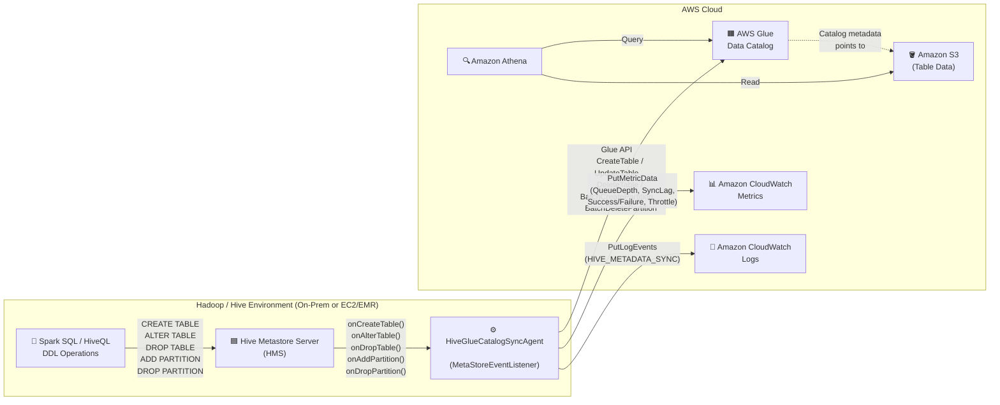
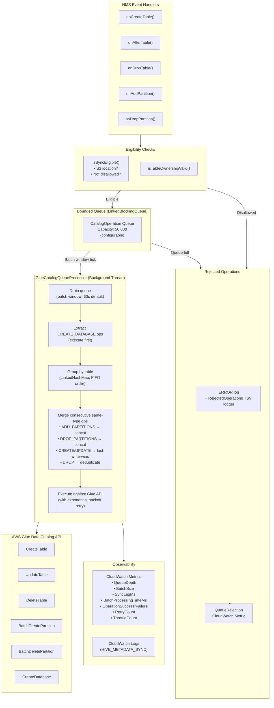

# Hive Glue Catalog Sync Agent — Architecture Diagrams

## High-Level Architecture

This diagram shows the end-to-end flow from the Hadoop/Hive environment through the sync agent to AWS services.

## Internal Processing Architecture

This diagram shows the internal queue-based processing pipeline inside the sync agent.

## Rendering

These diagrams use [Mermaid](https://mermaid.js.org/) syntax. You can render them:

- Directly in GitHub (Mermaid is supported in `.md` files)
- In VS Code with the "Markdown Preview Mermaid Support" extension
- At [mermaid.live](https://mermaid.live) (paste the code blocks)
- In any tool that supports Mermaid (Notion, Confluence, Docusaurus, etc.)

> **Note on AWS icons:** Native Mermaid doesn't support embedded AWS Architecture Icons.
> If you need official AWS icons, consider exporting these diagrams to
> [Draw.io](https://app.diagrams.net/) or using the
> [AWS Architecture Icons](https://aws.amazon.com/architecture/icons/) with a tool
> like PlantUML + AWS-PlantUML or Diagrams (Python `diagrams` library).
